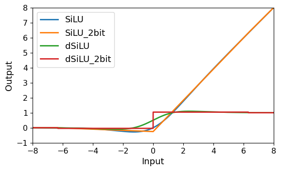

# Search ReSiLU2 and ReGELU2

In our paper, we represent the approximate activation function as the follows:


$`$
\begin{equation}
\begin{aligned}
\widetilde{h}_{\boldsymbol{a},\boldsymbol{c}}(x) &= \mathop{\sum}_{i=1}^{2^k-1}a_i \mathop{\mathrm{max}}(x - c_i, 0), \\
\text{s.t.} &\mathop{\sum}_{i=1}^{2^k-1} a_i = 1, \mathop{\sum}_{i=1}^{2^k-1} a_i c_i = 0.
\end{aligned}
\end{equation}
\tag{*}
$`$


In the practical implementation, we reparameterize the above piecewise linear function to a series of changing points, $`\{P(x_1, 0), P(x_2, y_2), ..., P(x_{2^k-1}, x_{2^k-1})|x_1 \leq x_2 \leq ... \leq x_{2^k-1}\}`$, with linear connecting lines between them.
This reparameterizaton allows us to solve the optimzation problem, $\min_{\boldsymbol{a},\boldsymbol{c}} \int_{-\infty}^{\infty} (h(x) - \widetilde{h}_{\boldsymbol{a},\boldsymbol{c}}(x))^2 \mathrm{d}x$, without concerning the constraint conditions.

## Usage
We provide the script to search ReSiLU2 and ReGELU2.
To use the **simulated annealing algorithm**, run the following command:
```bash
python sa_search.py --output-dir results
```
When the script is running, the results are going to be written into `sa_search_ReSiLU2.txt` and `sa_search_ReGELU2.txt` in the "output-dir".
There will be two columns, "energe" and "var_list", in the txt files.
The "energe" column represents the L2 distance between the target activation function and the approximate activation function.
The "var_list" column represents the changing points $`\{P(x_1, 0), P(x_2, y_2), P(x_3, x_3)\}`$, which are aranged in the order $x_1, x_2, x_3, 0, y_2, x_3$.

To get the form in (*), run the following commands:
```bash
python transform_results.py --results-path results/sa_search_ReSiLU2.txt --output-path results/sa_best_ReSiLU2.txt

python transform_results.py --results-path results/sa_search_ReGELU2.txt --output-path results/sa_best_ReGELU2.txt
```
This script will choose the best results in "results-path", convert them into the form in (*) and output the optimal $\boldsymbol{a},\boldsymbol{c}$ into "output-path".

## Visualization
We can compare the searched approximate activation functions with the target functions by plotting their original functions and derivatives.
We provide a script for visualizing the results from `transform_results.py`.

For example:
```bash
python plot_results.py --target silu --results-path results/sa_best_ReSiLU2.txt
```
This command will produce the following plot:




## Larger $k$
Our simulated annealing searching script is stable when setting $k=2$ in (*), but tends to be instable when setting $k > 2$.
Although we have only implemented CUDA kernels for ReSiLU2 and ReGELU2, we provide **SGD based searching** script for $k > 2$.

To search ReSiLUk and ReGELUk for $k=4$, run the following commands:
```bash
python sgd_search.py --output-dir results --kbit 4 --num-steps 100000 --repeats 5

python transform_results.py --results-path results/sgd_search_ReSiLU4.txt --output-path results/sgd_best_ReSiLU4.txt

python transform_results.py --results-path results/sgd_search_ReGELU4.txt --output-path results/sgd_best_ReGELU4.txt
```

To compare the ReSiLU4 and SiLU, run the command:
```bash
python plot_results.py --target silu --results-path results/sgd_best_ReSiLU4.txt
```


